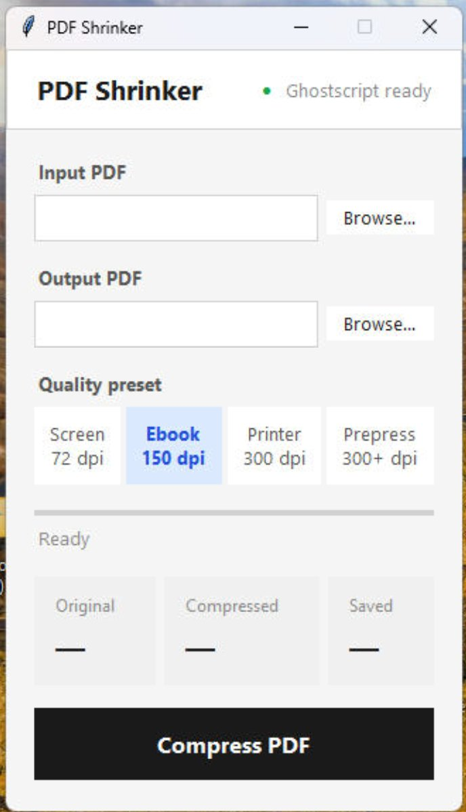

# PDF Shrinker

A lightweight desktop app that compresses PDF files using Ghostscript. Drag a PDF onto the app, pick a quality preset, and get a smaller file — no runtime dependencies required on target machines.

Available for **Windows** and **macOS**.

---

## Screenshot



---

## For End Users — Using the App

### Option 1: Drag and Drop
Drag any `.pdf` file directly onto `PDF Shrinker.exe` (Windows) or `PDF Shrinker.app` (macOS). The app opens with the input and output fields already filled in. Just click **Compress PDF**.

### Option 2: Browse for a File
Open the app, click **Browse…** next to the Input field, select your PDF, then click **Compress PDF**.

The output file is saved alongside the original with `_compressed` added to the filename (e.g. `report.pdf` → `report_compressed.pdf`). You can change the output path at any time using the second Browse button.

### Compression Presets

| Preset | Image DPI | Best For | Typical Savings |
|--------|-----------|----------|-----------------|
| Screen | 72 dpi | Email, web sharing | 60–85% |
| Ebook | 150 dpi | General use, e-readers | 40–70% |
| Printer | 300 dpi | Desktop printing | 20–50% |
| Prepress | 300+ dpi | Commercial/professional printing | 10–30% |

> **Tip:** If a compressed file ends up *larger* than the original, the source PDF was already well-optimised. Keep the original.

### Progress Bar
The progress bar tracks compression page-by-page in real time. When finished, the result panel displays the original size, compressed size, and total savings. The Saved card turns green when space is successfully recovered.

---

## For Developers — Building the App

> **Cross-compilation is not possible.** You must build on the target platform:
> - Build the Windows `.exe` on a Windows machine
> - Build the macOS `.app` on a Mac

---

### Windows Build

#### Requirements

| Tool | Download |
|------|----------|
| Python 3.10+ | https://www.python.org/downloads/ |
| Ghostscript (any recent version) | https://ghostscript.com/releases/gsdnld.html |

When installing Python, tick **"Add Python to PATH"**.

Both tools only need to be on the **build machine**. The output `.exe` is fully self-contained.

#### Steps

1. Install Python and Ghostscript
2. Unzip the project folder
3. Double-click `build.bat`

The script will:
- Auto-detect your Ghostscript installation by scanning `C:\Program Files\gs\gs*\bin\`
- Copy GS binaries, DLLs, fonts, and resource files into a staging folder
- Install Python dependencies (`pypdf`, `Pillow`, `pyinstaller`) via pip
- Run PyInstaller with the bundled app icon (`app_icon.ico`)
- Flush the Windows icon cache so the icon appears immediately
- Clean up staging files

**Output:** `dist\PDF Shrinker.exe` (~40–55 MB)

#### Windows Troubleshooting

**`'pyinstaller' is not recognized`**
Your Python Scripts folder is not on PATH. `build.bat` calls `python -m PyInstaller` to avoid this. If it still fails, run `python -m pip install pyinstaller` manually.

**`Ghostscript not found`**
The script scans standard install paths and PATH. If it still fails, confirm GS is installed, then try adding `C:\Program Files\gs\gs<version>\bin` to your system PATH.

**App shows Python icon instead of custom icon**
This is a Windows icon cache issue. Try: right-click the `.exe` → Properties to confirm the icon is embedded. If it shows there but not in Explorer, run `ie4uinit.exe -show` in a command prompt or restart Explorer.

**Antivirus false positive**
PyInstaller bundles a Python interpreter and DLLs into a single file, which some heuristic scanners flag. This is a known false positive. Whitelist the `.exe` in your AV software if needed.

---

### macOS Build

#### Requirements

| Tool | Install Command |
|------|----------------|
| Python 3.10+ | https://www.python.org/downloads/ or `brew install python` |
| Homebrew | https://brew.sh |
| Ghostscript | `brew install ghostscript` |
| dylibbundler | `brew install dylibbundler` |
| python-tk | `brew install python-tk` |

`dylibbundler` collects and fixes up the `.dylib` dependencies that Ghostscript links against. `python-tk` provides tkinter, which Homebrew's Python omits by default.

#### Steps

```bash
brew install ghostscript dylibbundler python-tk
chmod +x build_mac.sh
./build_mac.sh
```

The script will:
- Auto-detect Ghostscript in Homebrew (Apple Silicon `/opt/homebrew/bin/gs` and Intel `/usr/local/bin/gs`)
- Copy the `gs` binary and run `dylibbundler` to collect all `.dylib` dependencies
- Copy GS fonts, lib, and Resource files
- Create a temporary Python virtual environment (avoids macOS PEP 668 restrictions)
- Run PyInstaller with the bundled app icon (`app_icon.icns`)
- Clean up all staging files and the venv

**Output:** `dist/PDF Shrinker.app` — drag to Applications to install.

#### macOS Troubleshooting

**`dylibbundler not found`**
Run `brew install dylibbundler`.

**`Ghostscript not found`**
Run `brew install ghostscript`. The script checks `/opt/homebrew/bin/gs` (Apple Silicon) and `/usr/local/bin/gs` (Intel) automatically.

**`Could not find a Python installation with tkinter`**
Run `brew install python-tk`. Homebrew's Python omits tkinter by default; this package adds it.

**Gatekeeper / "app is damaged" warning**
macOS blocks unsigned apps downloaded from the internet. To allow it:
```bash
xattr -cr "/path/to/PDF Shrinker.app"
```
Or right-click the app → Open → Open anyway.

**Apple Silicon (M1/M2/M3) vs Intel**
The app builds for your Mac's architecture. To build a universal binary, add `--target-arch universal2` to the PyInstaller call in `build_mac.sh` — but all bundled libraries must themselves be universal.

---

## How It Works

### Compression Engine
The app uses Ghostscript to reprocess PDF content. Ghostscript re-renders each page at the target DPI and re-encodes all embedded images, fonts, and streams — this is why it achieves much better compression than tools that only strip metadata.

The GS command used internally:
```
gs -sDEVICE=pdfwrite -dCompatibilityLevel=1.4
   -dPDFSETTINGS=/<preset> -dNOPAUSE -dBATCH
   -sOutputFile=<output.pdf> <input.pdf>
```

### Bundled Ghostscript

**Windows:** `build.bat` copies `gswin64.exe` (or `gswin64c.exe`) and all `.dll` files from your local Ghostscript install into the PyInstaller bundle under `gs_bin/`.

**macOS:** `build_mac.sh` copies the `gs` binary, then runs `dylibbundler` to trace all `.dylib` dependencies and copy them alongside the binary with corrected `@executable_path`-relative rpaths so they're found inside the bundle rather than on the build machine's filesystem.

A marker file (`gs_bin/gs_exe_name.txt`) records the executable name so the app can locate it at runtime via `sys._MEIPASS`.

### Live Progress
Ghostscript prints `Page N` to stdout as it processes each page. The app reads this line-by-line in a background thread and converts page number / total pages into a 0–95% progress value. The final 5% completes when the process exits cleanly. On Windows, the subprocess is launched with `CREATE_NO_WINDOW` so no console box appears.

### Fallback Mode (no Ghostscript)
If Ghostscript is not detected, the app falls back to a pure-Python pipeline using `pypdf` and `Pillow`. It re-compresses embedded images as JPEG at a user-chosen quality level and strips redundant objects. Effective for image-heavy PDFs; less so for text-only ones.

### Drag and Drop
Windows and macOS both pass a dragged file's path as `sys.argv[1]` when a file is dropped onto the app. The app detects this on startup and pre-populates the input and output fields.

---

## File Structure

```
pdf_shrinker/
├── pdf_shrinker.py        — Main application (GUI + compression logic)
├── build.bat              — Windows build script
├── build_mac.sh           — macOS build script
├── requirements.txt       — Python dependencies
├── app_icon.ico           — Windows app icon (multi-size)
├── app_icon.icns          — macOS app icon
├── app_icon.png           — Icon source image
├── screenshot_windows.png — Windows screenshot
└── README.md              — This file
```

After building:
```
dist/
├── PDF Shrinker.exe    ← Windows output (~40–55 MB)
└── PDF Shrinker.app    ← macOS output (~45–60 MB)
```

---

## License & Third-Party Components

This project is unlicensed — use it however you like.

Third-party components bundled in the output app:

| Component | License | Link |
|-----------|---------|------|
| Ghostscript | AGPL v3 (free for personal/open-source use; commercial license available) | https://ghostscript.com/licensing/index.html |
| pypdf | BSD 3-Clause | https://github.com/py-pdf/pypdf/blob/main/LICENSE |
| Pillow | HPND | https://github.com/python-pillow/Pillow/blob/main/LICENSE |
| Python | PSF License | https://docs.python.org/3/license.html |

> **Note on Ghostscript licensing:** Ghostscript is AGPL-licensed. Bundling it in a distributed application is permitted for personal and open-source use. For commercial distribution, review the Artifex commercial licensing page at https://artifex.com/licensing/

---

## Links

| Resource | URL |
|----------|-----|
| Python download | https://www.python.org/downloads/ |
| Homebrew (macOS) | https://brew.sh |
| Ghostscript download | https://ghostscript.com/releases/gsdnld.html |
| Ghostscript commercial license | https://artifex.com/licensing/ |
| dylibbundler | https://github.com/auriamg/macdylibbundler |
| pypdf documentation | https://pypdf.readthedocs.io/ |
| Pillow documentation | https://pillow.readthedocs.io/ |
| PyInstaller documentation | https://pyinstaller.org/en/stable/ |
